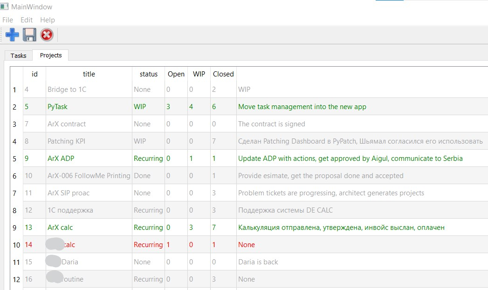

# pytask
A GTD implementation to track tasks within projects

<image src="doc/pytask_screenshot.jpg" width="800" alt="Task list"/>

Some features are:
* Tasks are linked to projects
* A project is a piece of work longer than one day, which can and should be decomposed.
* Tasks are ordered by priority
* Tasks can be delegated by adding a name to the correspondent attribute
* Color coding of tasks by their attributes:
  * Tasks for today are green
  * Delegated tasks are blue
  * Tasks which are *done* striken through
  * *Complete* tasks are invisible
* Tracking projects:
  * Monitor number of tasks grouped by their statuses: Open, WIP, Done/Closed
  * Color coding of projects: 
    * grey when no open/WIP tasks 
    * red if there are open tasks, but no WIP
    * green when there are both open and WIP tasks in the project

